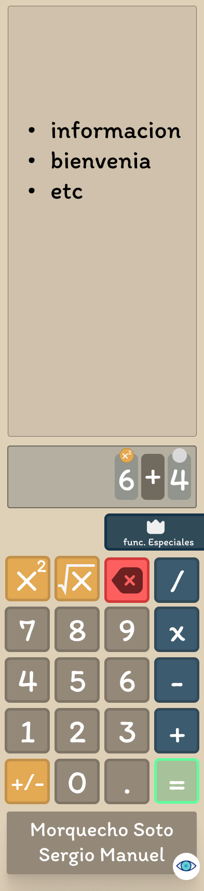
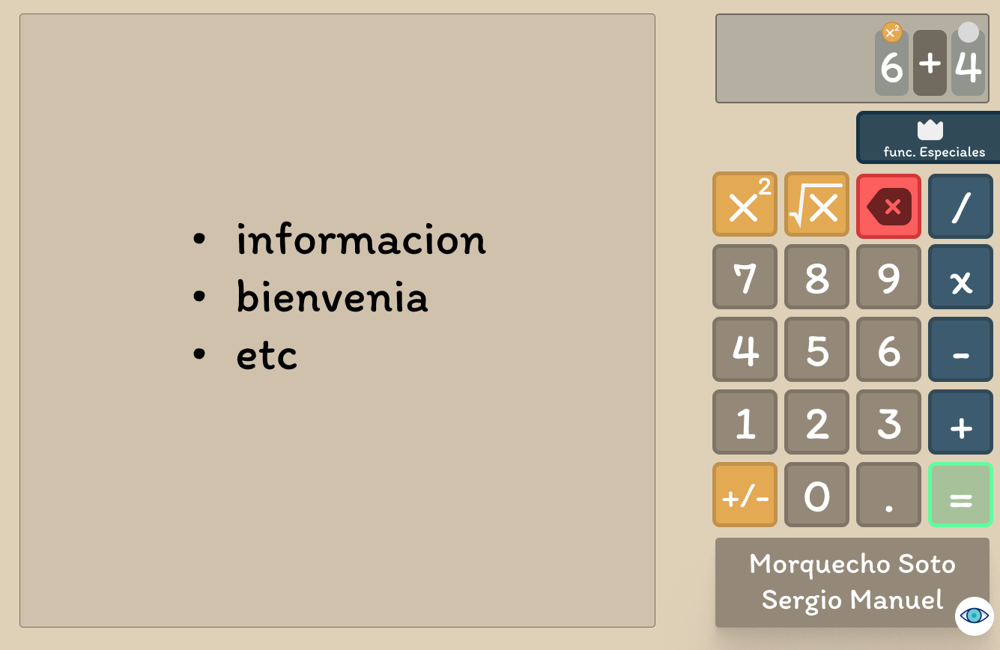
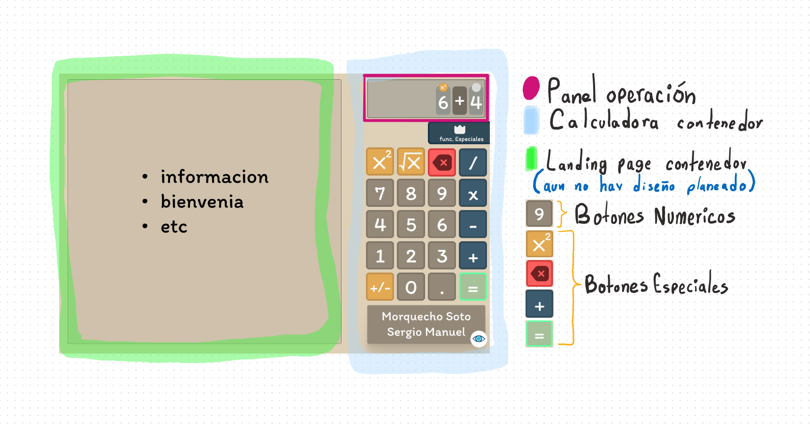
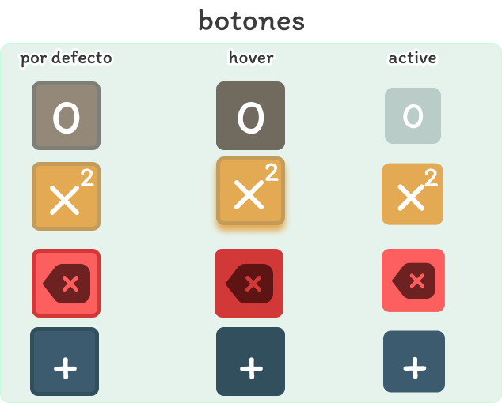

# Documentación del paquete - __estilos__

En esta documentación se explicara como se estilizan los componentes y secciones de la aplicación ademas de como funciona la UI. 
Este paquete solo funciona como __paquete empleado__ y su jefe es el __paquete src__.

## User Interface explicación
### Movil

### Escritorio

La aplicación se divide en 2 partes, una landing page y la calculadora en si.

### Landing page contenedor - aside
Esta sección da información sobre la aplicación como usarla y te da la opción de ir a usar directamente la calculadora __(esto en móvil ya que en escritorio tienes la calculadora alado de la landing page)__.

### Calculadora contenedor - article
Esta sección no necesita mucha explicación, es la calculadora en si.

#### Panel operación - section
Es la representación de la operación matemática que el usuario va a realizar.
Este panel contiene __items de panel__, (da click aquí para leer su funcionamiento).

Los __items de panel__ se van agregando al presionar los botones numéricos o los botones especiales de operación. (da click aquí para ver la clasificación y funcionamiento de los botones)

> #### items de panel 

Estos tienen 2 estados :

1. normal
2. seleccionado 

Al dar click a un __botón numérico__ o un __botón especial de operación__ se agrega un item de panel y su estado es __normal__.

Al dar click a un __item de panel__ este cambia su estado a __seleccionado__.
Resumidamente, seleccionas un item de panel para cambiar su contenido (cambiar un 6 a 4 o un + a  -).

__(da click aquí para ver el funcionamiento de los items de panel)__

> #### Botones 

Son los botones de la calculadora que afectan o modifica el [panel de operacion](#panel-operación---section).

existen...
* Botones numéricos
* Botones especiales
    * De operación.
    * De acción.
    * De borrado.
    * De resultado.

Y sus es estilos son los siguientes.

a continuación se dará una explicación de como funciona cada modulo. 
## index.css
Aquí se declara...
* Variables de los colores de la aplicación.
* Comportamiento de la [landing page](#landing-page-contenedor---aside) y la [calculadora](#calculadora-contenedor---article) en si (el comportamiento cuando el dispositivo es un Movil o desktop).
